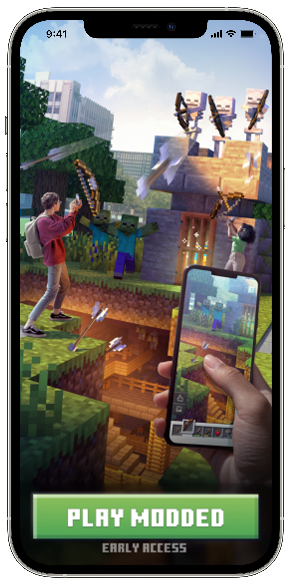
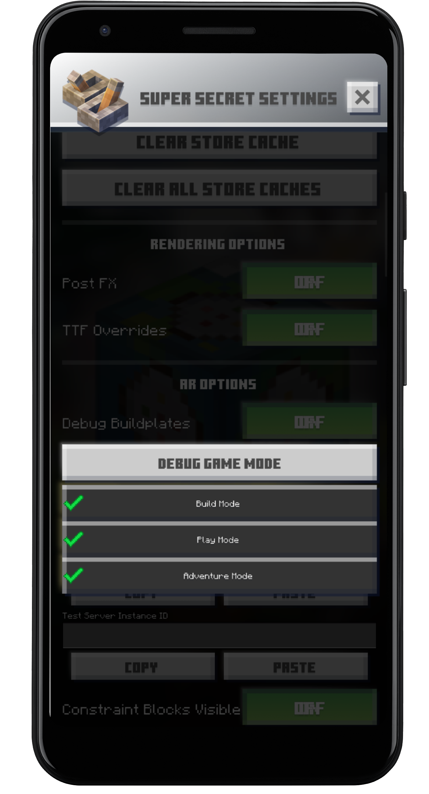

   Project Earth   

Project Earth
=============

### Sustaining Minecraft Earth, beyond the Sunset.

What is Project Earth?
======================

We're recreating the server system for Minecraft Earth, and also _slightly_ modding the client to allow for you to join the custom server. This allows for anyone who wants to to continue playing the game by importing their data into our servers, and lets people pick up where they left off after the official servers close.

How Does It Work?
=================

We run our homemade Project Earth API (currently closed source, but will be open shortly) in combination with our custom server implementation using [CloudburstMC/Protocol](https://github.com/CloudburstMC/Protocol) to run the server side parts of Minecraft Earth. We then patch the app so that it connects to our server instead of the official server.

• •

